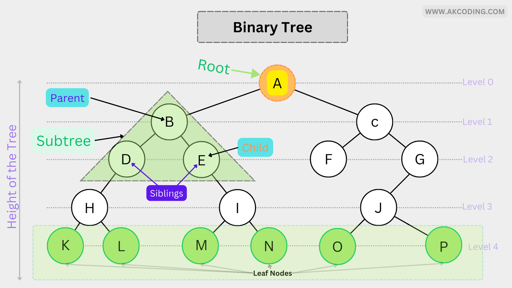
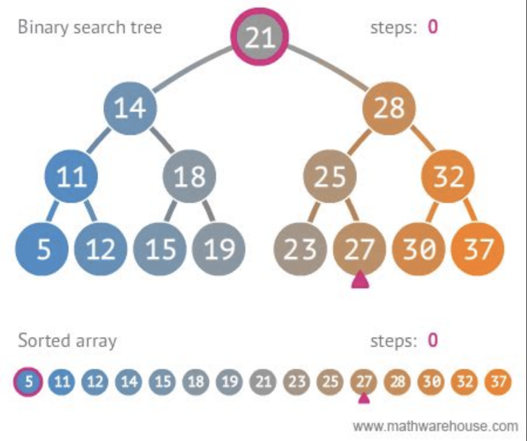

# Binary Trees / Binary Search Trees

- **Perfect tree**: all levels are filled up
- **Complete/full tree**: all levels are filled up, except possibly the last level
- **Balanced tree**: the height of the left and right subtrees differ by no more than 1

## Representations

- Array: 
  - Fill the array from L->R per level
  - An index `i` will have its right child at `2i` and left child at `2i+1`
- Linked List: 
  - Each node should be an object with a `left` and `right` pointer

## Traversal

### 1. Depth First Search (DFS)

Search along the **height** of the tree (vertically) 
Can be done _recursively_ or _iteratively_ 
- Preorder: `NODE - LEFT - RIGHT`
- Inorder: `LEFT - NODE - RIGHT`
- Postorder: `LEFT - RIGHT - NODE`

Iterative can only do Preorder. Recursive can do all. 

>Uses a STACK

### 2. Breadth First Search (BFS) / Level-Order Search
Search along the **width/levels** of the tree (horizontally) 
> Uses a QUEUE

## Binary Search Trees

BSTs are Binary Trees with the following properties:
1. All descendants to the LEFT of a node are <
2. All descendants to the RIGHT of a node are >=

This makes searching for an element very efficient `O(log n)`, bec
at each step you can eliminate the entire left or right half

Inorder DFS on a BST will return the elements in sorted order
(hence the name)

## Time & Space Complexity

**Binary Trees**
  - Searching
    - Time: `O(n)`
    - Space: `O(n)` (for a balanced tree, it would be `H` where `H` is the height)

**BSTs**
- Searching: 
  - Time: `O(log n)`
  - Space: `O(n)` (for a balanced tree, it would be `log n`)
 