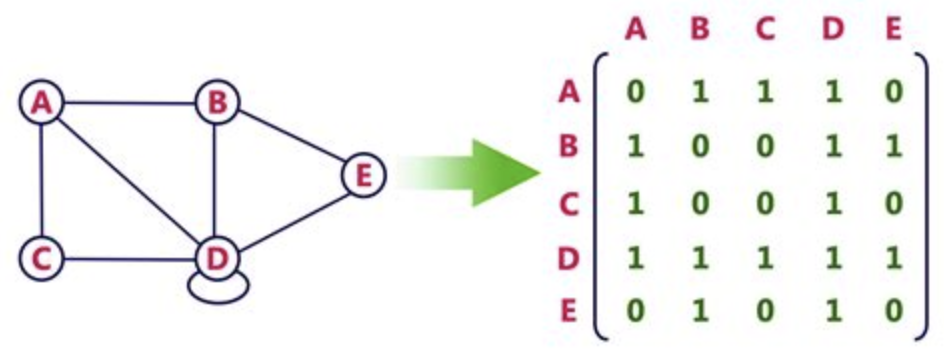

# Graphs

Data structures that consist of nodes connected by edges 

Linked Lists and Binary Trees are types of graphs

- **Directed graphs**: nodes have an explicit direction (i.e. one-way)
- **Undirected graphs**: nodes do not have an explicit direction (i.e. two-way)
- **Cyclic graphs**: contains cycle/s
- **Acyclic graph**: no cycles
- **Connected graph**: there is an edge between every node (no stray nodes)
- **Trees**: connected, acyclic graphs
  - Trees will always have `N - 1` edges, where `N` is num nodes

## Representations

- **Edge list**: array of edges in the form of `[FromNode, ToNode]`
> `[[0, 1], [1, 2], [3, 4]]`

_More difficult to work with when you just want to understand connections that a particular node has_

- **Adjacency Matrix**: `N * N` matrix with 0s and 1s indicating connections

_More versatile, but can waste a lot of space._ 
_Will be a symmetric matrix for undirected graphs (identical reflection across diagonal)._

- **Adjacency List**: dictionary `key:value` pair of a node and its connections
> `{ 0:[1], 1:[2, 3, 4], 2:[1], 3:[], 4:[] }`

_Ideal for exploring connections of a particular node_

- **Classes**: have a `Node` object with `value` and `neighbors` properties

## Traversal
1. DFS (stack)
    - Recursive
    - Iterative
2. BFS (queue)

All traversals must have a `seen` set (hash set) to avoid revisiting cycles

## Time Complexity

|         | Time   | 
|:--------|:-------|
| DFS     | `O(v+e)` |
| BFS     | `O(v+e)` |

_(vertices + edges)_

Space complexity will be `O(v+e)` for an **adjacency list**
