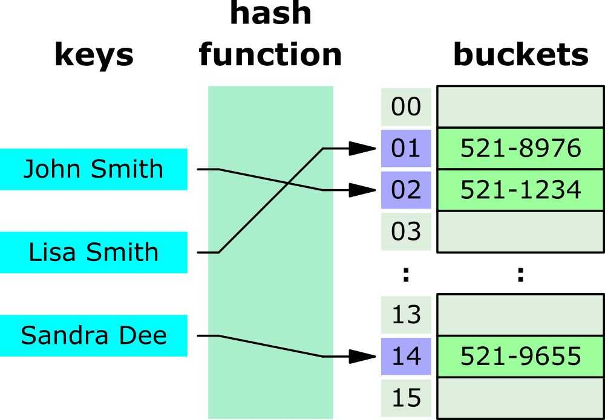

# Hash Sets & Maps

## Hash Function

Takes a value and hashes it to return an index

### Collisions
**Collision**: multiple values hashing to the same index

- **Separate chaining**: store collisions as a linked list in the same bucket
- **Linear probing**: check sequentially for the next avail bucket
- **Quadratic probing**: use a quadratic function to find the next avail bucket

### What is Hashable
Only immutable data types can be hashed
- **Python immutable types**: strings, integers, floats, tuples
- **Python mutable types**: lists, dicts

## Hash Sets

A hashed collection of _unique_ elements

> The Python `set()` function is a hash set

## Hash Maps

A `key:value` pair mapping

Keys must be hashable

> The Python `dict {}` data type is a hash map

## Time Complexity

|        | Hash Set | Hash Map | 
|:-------|:---------|:---------|
| Lookup | *O(1)    | *O(1)    |
| Add    | O(1)     | O(1)     |
| Delete | O(1)     | O(1)     |

Lookups are amortized `*O(1)`, bec bad collisions are possible `O(n)` but _very_ unlikely with a good hash function