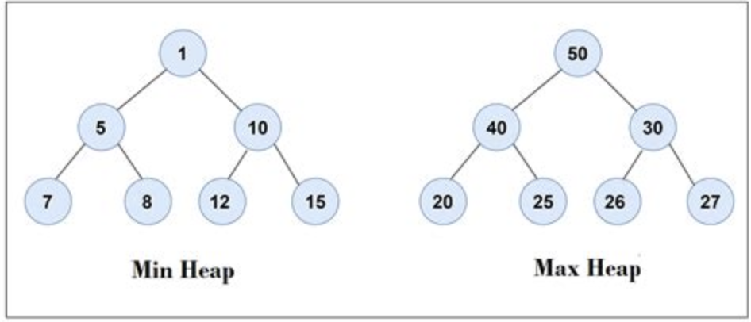

# Heaps & Priority Queues

**Min Heap**: a binary tree where every parent is LESS than its children 
- The smallest value will be the root node

**Max Heap**: a binary tree where every parent is GREATER than its children 
- The largest value will be the root node

**Priority Queue**: a min heap that stores tuples of (<priority_num>, data) so you can 
pop based off priority number and have the data popped with it

## Representations

- Array
  - _Efficient if the tree is relatively height balanced_
- Linked list

## Operations

1. Heap pop
2. Heap push
3. Heap peek
4. Heapify

Any push or pop operation requires fixing the tree, which will be `O(log n)` since it's an operation along the height

Building a heap from a regular binary tree (heapify) has `O(n)` complexity

## Heap Sort

A very efficient sorting algorithm that converts an array to a min heap (heapify), then repeatedly pops the min while fixing the tree

`O(n logn)`
- `n` pops
- `log n` time to fix the tree after each pop

Space complexity can be `O(n)` or `O(1)` depending on the implementation

## Time Complexity

|           | Min/Max Heap |
|:----------|:-------------|
| Heap pop  | O(log n)     |
| Heap push | O(log n)     |
| Heap peek | O(1)         |
| Heapify   | O(n)         |