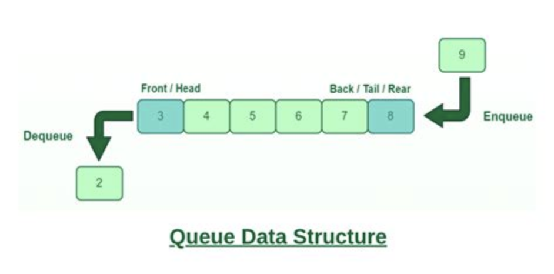

# [`Queues`](./queues.py)

**FIFO**: First In, First Out

## Representations

- Array - _INEFFICIENT_: 
  - Items are added (enqueued) to the right and removed (dequeued) from the left
  - Removing from the left of an array (i.e. first index) is inefficient because you will always have to shift the elements
- Linked List - _IDEAL_: 
  - The head is modified to dequeue and the tail is modified to enqueue (both constant time operations)
 

## Operations

1. Enqueue
2. Dequeue
3. isEmpty

## Time Complexity

|         | Dynamic Array | Linked List | 
|:--------|:--------------|:------------|
| Enqueue | *O(1)         | O(1)        |
| Dequeue | O(n)          | O(1)        |
| isEmpty | O(1)          | O(1)        |
