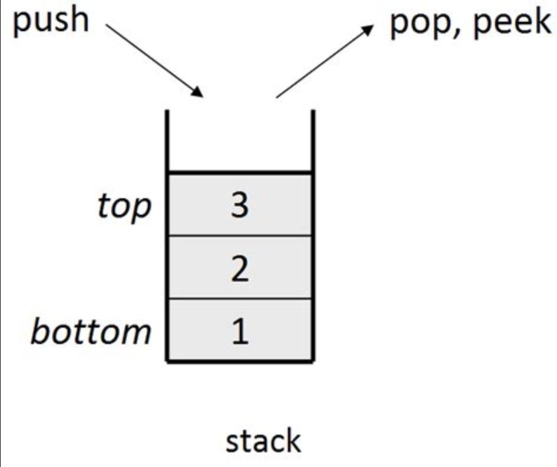

# Stacks

**LIFO**: Last In, First Out

## Representations

- Array - _GOOD_: 
  - Items are pushed/popped from the right end of the array
  - Appending to a dynamic array can *sometimes* require resizing
- Linked List - _MOST EFFICIENT_: 
  - The tail is modified to push/pop
  - In (doubly) linked lists, adding to the end is *always* constant

## Operations

1. **Push**
2. **Pop**
3. **Peek**
4. **isEmpty**

## Time Complexity

|               | Dynamic Array | Linked List | 
|:--------------|:--------------|:------------|
| Push (append) | `*O(1)`         | `O(1)`       |
| Pop           | `O(1)`          | `O(1)`        |
| Peek          | `O(1)`          | `O(1)`       |
| isEmpty       | `O(1)`          | `O(1)`        |
